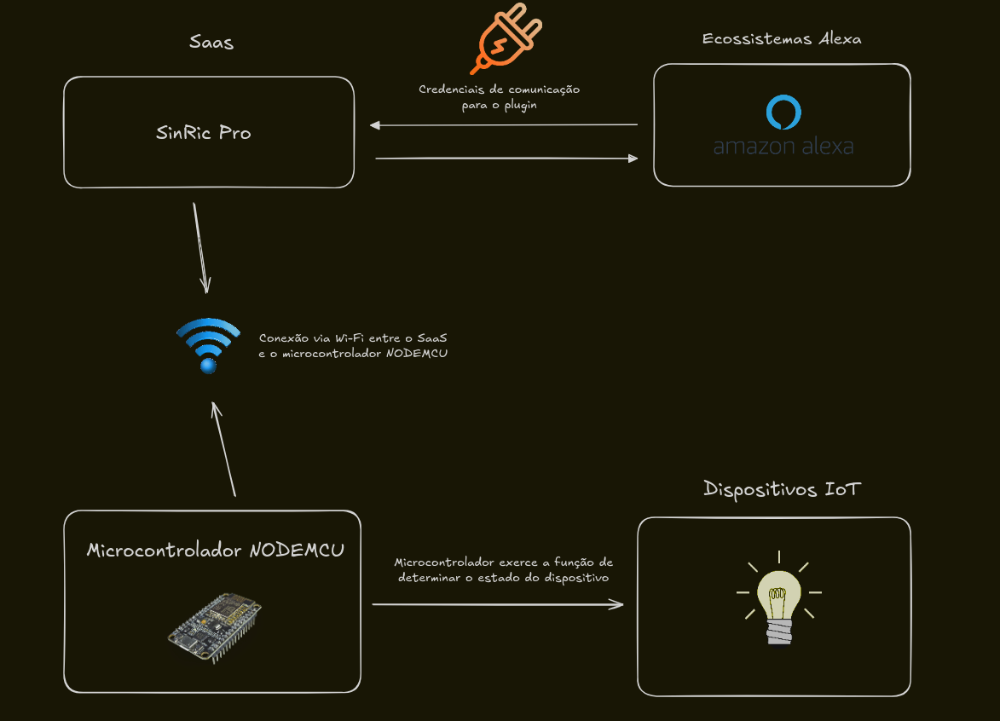

# Controle de Dispositivo com ESP8266 e SinricPro
## 1. Bibliotecas

```cpp
#include <Arduino.h> // Essa é a biblioteca principal usada em todos os projetos com o Arduino.
#include <ESP8266WiFi.h> // É a biblioteca oficial para o ESP8266 que gerencia a conectividade Wi-Fi.
#include <SinricPro.h> // Essa é a biblioteca principal do SinricPro, que gerencia a comunicação entre o ESP8266 e os servidores do SinricPro.
#include <SinricProSwitch.h> // Biblioteca específica para configurar um dispositivo do tipo interruptor (switch) no SinricPro.
```

## 2. Função onPowerState

```cpp
bool onPowerState(const String &deviceId, bool &state)
{
  Serial.printf("Device %s turned %s (via SinricPro) \r\n", deviceId.c_str(), state ? "on" : "off");
  myPowerState = state;
  digitalWrite(RELE_PIN, myPowerState ? LOW : HIGH);
  return true;
}
```

- Essa função é executada toda vez que o dispositivo recebe um comando remoto pelo SinricPro. Ela alterna o estado do relé (liga/desliga).

## 3. Função handleButtonPress

```cpp
void handleButtonPress()
{
  unsigned long actualMillis = millis();
  if (digitalRead(BUTTON_PIN) == LOW && actualMillis - lastBtnPress > 1000)
  {
    myPowerState = !myPowerState;
    digitalWrite(RELE_PIN, myPowerState ? LOW : HIGH);
    SinricProSwitch &mySwitch = SinricPro[SWITCH_ID];
    mySwitch.sendPowerStateEvent(myPowerState);
    Serial.printf("Device %s turned %s (manually via flashbutton)\r\n",
                  mySwitch.getDeviceId().c_str(), myPowerState ? "on" : "off");
    lastBtnPress = actualMillis;
  }
}
```

- Essa função detecta quando o botão é pressionado e verifica se já passou o tempo necessário para evitar múltiplos disparos (debounce). Ela alterna o estado do relé e notifica a plataforma SinricPro sobre a mudança.

## 4. Função setupWiFi

```cpp
void setupWiFi()
{
  Serial.printf("\r\n[Wifi]: Connecting");
  WiFi.begin(WIFI_SSID, WIFI_PASS);
  while (WiFi.status() != WL_CONNECTED)
  {
    Serial.printf(".");
    delay(250);
  }
  Serial.printf("connected!\r\n[WiFi]: IP-Address is %s\r\n", WiFi.localIP().toString().c_str());
}
```

- Esta função conecta o ESP8266 à rede Wi-Fi usando o SSID e a senha fornecidos.
Enquanto a conexão não é estabelecida, imprime pontos no monitor serial. Quando a conexão é bem-sucedida, exibe o endereço IP.

## 5. Função setupSinricPro

```cpp
void setupSinricPro()
{
  SinricProSwitch &mySwitch = SinricPro[SWITCH_ID];
  mySwitch.onPowerState(onPowerState);
  SinricPro.onConnected([]() { Serial.printf("Connected to SinricPro\r\n"); });
  SinricPro.onDisconnected([]() { Serial.printf("Disconnected from SinricPro\r\n"); });
  SinricPro.begin(APP_KEY, APP_SECRET);
}
```

- Essa função inicializa a conexão com o SinricPro e define as funções de callback para tratar eventos, como conexão ou desconexão e mudanças de estado do dispositivo.

## 6. Função setup
```cpp
void setup()
{
  pinMode(BUTTON_PIN, INPUT_PULLUP);
  pinMode(RELE_PIN, OUTPUT);
  digitalWrite(RELE_PIN, HIGH);
  Serial.begin(BAUD_RATE);
  setupWiFi();
  setupSinricPro();
}
```

- Configura os pinos do botão e do relé, inicializando o botão como entrada (com pull-up interno ativado) e o relé como saída. Também inicializa a comunicação serial e estabelece as conexões Wi-Fi e SinricPro.

## 7. Loop Principal (loop)
```cpp
void loop()
{
  handleButtonPress();
  SinricPro.handle();
}
```

- Monitora continuamente o botão físico para capturar interações manuais e verifica comandos ou eventos recebidos da plataforma SinricPro.

### ARQUITETURA DO PROJETO



### RESULTADO

